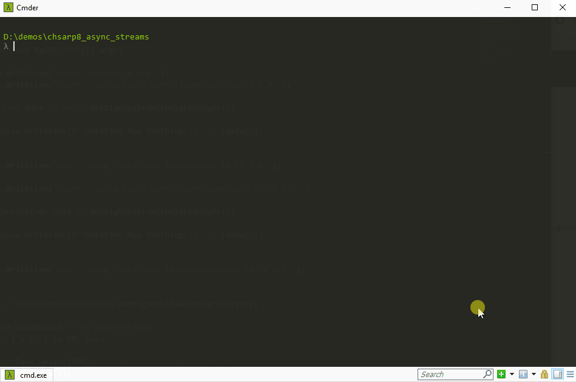

# Run with docker
You can use Docker to execute the project and show results.
```bash
> docker-compose up
```

# Result


# Bonus
Read the post about C# 8.0 news in my blog [Spanish]:
[https://dagope.github.io/2019/02/19/novedades-csharp8](https://dagope.github.io/2019/02/19/novedades-csharp8)